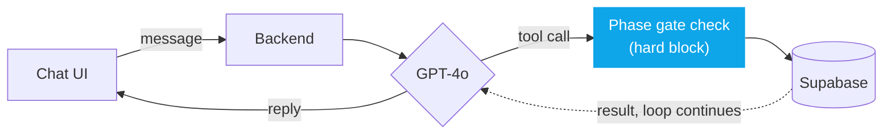

# AI Manager Agent — Marlabs Delivery Assistant

An internal Marlabs tool that helps a delivery manager (or PM) track client
projects through a fixed 7-phase document lifecycle — Pre-requisites,
Requirement Analysis, System Design, Implementation, Testing, Deployment,
Maintenance — without anyone accidentally skipping a required document or
losing track of who's stuck where.

It's two things in one app:

1. **A conversational assistant** — a PM can ask in plain English for a
   template, check a client's status, upload a completed document, or
   search across everything already filed.
2. **A manager dashboard** — a portfolio-level view of every client at once,
   with clients flagged automatically if they've gone quiet mid-phase.

The core rule the whole system is built around: **a document belonging to
phase N can't be requested or filed until every required document from every
earlier phase already exists for that client.** This is a hard block
enforced in the backend, not a suggestion — the conversational agent can't
talk its way around it, because the check happens in the API layer
regardless of what the AI says.

## How it works

See **[`docs/rag_agent_flow.md`](docs/rag_agent_flow.md)** for the full
flowchart of a chat request end to end — how the model decides whether it
needs a tool, and where the phase-gate check actually runs (spoiler:
server-side, in plain Python, never inside the model's own reasoning).



## Features

- **Chat assistant** — list phases, check a client's status, request a
  master template (hard-gated), or delete a client (soft-delete, recoverable,
  always confirmed by a human before anything happens — the AI never deletes
  anything itself).
- **Document upload** — file a completed document via the chat (drag-and-drop
  or attach) or a standalone upload panel, validated server-side for file
  type and size.
- **Document version history** — re-uploading never overwrites the previous
  file; every upload is kept as a new version forever, viewable, downloadable,
  and restorable (via the Dashboard search or the chat assistant).
- **Document search** — find any stored document by client, type, or
  filename, with a direct download link.
- **Manager dashboard** — every client's phase progress, current blocking
  phase, and a stale-client flag with a copy-to-clipboard follow-up reminder.
- **Saved chat history**, drag-and-drop attach, message avatars, and an
  animated typing indicator.

See **[`PROJECT_OVERVIEW.md`](PROJECT_OVERVIEW.md)** for the full feature
list and a dated changelog of everything that's changed.

## What's not built yet

- **No real SharePoint integration** — documents currently live in local
  filesystem storage; the storage layer is already abstracted so this is a
  swap-in, not a rewrite, once SharePoint access is available.
- **No authentication** — every API route is open. Fine for local dev and
  controlled demos, not yet for wider access.
- **No rate limiting** on the chat endpoint.

Full detail on each in [`PROJECT_OVERVIEW.md`](PROJECT_OVERVIEW.md#pending).

## Tech stack

- **Backend:** Python 3.11+, FastAPI, [OpenAI](https://platform.openai.com/)
  (GPT-4o) for the conversational agent, [Supabase](https://supabase.com/)
  (Postgres) accessed via its REST API
- **Frontend:** React 19 + Vite, plain JS/CSS (no TypeScript, no Tailwind)
- **Storage:** abstracted behind a `StorageBackend` interface — local
  filesystem today, swappable for SharePoint later with no changes to
  gating or service logic

## How to run it locally

**Prerequisites:** Python 3.11+, Node 18+, git.

```bash
git clone https://github.com/Marlabs-Innovations-Private-Limited/RAG-agent.git
cd RAG-agent
git checkout pullingado
```

**Backend setup** — you'll need an `OPENAI_API_KEY` and the shared
`SUPABASE_URL`/`SUPABASE_KEY` (ask a teammate who already has them, sent
privately, never in a group chat):
```bash
cd backend
pip install -r requirements.txt
cp .env.example .env   # fill in the three values above
alembic upgrade head
python -m app.db.seed
python -m app.db.seed_templates
```

**Frontend setup:**
```bash
cd ../frontend
npm install
```

**Run it** (from `/frontend`, every time after the one-time setup above):
```bash
npm run dev
```
This starts both backend (port 8000) and frontend (port 5173) together.
Open `http://localhost:5173` and try typing "list phases" into the chat —
a reply back confirms everything's wired up correctly.

**Run the tests** (from `/backend`):
```bash
python -m pytest tests/ -q
```

Full setup detail, troubleshooting for common first-run errors, and the
reasoning behind two different Supabase connection methods are in
[`PROJECT_OVERVIEW.md`](PROJECT_OVERVIEW.md) and
[`backend/README.md`](backend/README.md).
