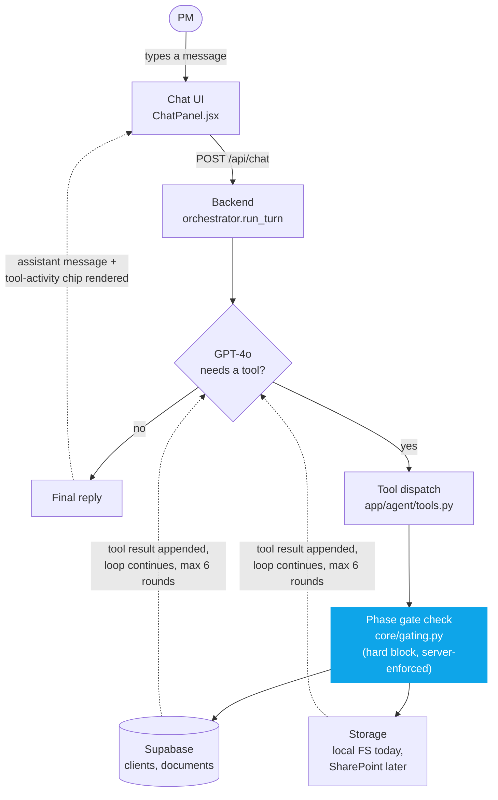

# How the RAG Agent Works

One PM message can trigger several round trips between the chat model and the
backend before a reply comes back. The key property: **the phase gate is
checked by the backend on every tool call, not by the model** — the AI
cannot talk its way past a missing document, because the check happens in
plain Python against Supabase, not inside the prompt.

## What each step means

1. **PM sends a message** — e.g. "request the Pricing template for Hillenbrand."
2. **Backend builds the prompt** — system rules + full conversation history, sent to GPT-4o with the tool definitions attached.
3. **Model decides** — reply directly, or call a tool (check status, request template, propose delete).
4. **Tool dispatch runs server-side** — never trusts the model's own claim about what's allowed.
5. **Gate check** compares the client's filed documents against every earlier phase, before any template is handed over.
6. **Result goes back to the model** as a tool message — blocked (with exactly what's missing) or allowed.
7. **Loop continues** up to 6 rounds if more tools are needed, then the model produces its final reply.
8. **UI renders both** — the assistant's words, and a separate tool-activity chip showing the actual system outcome.

## Why this is the thing to point at

Nothing about the gating logic lives inside the prompt. Even if the model
"wanted" to hand over a Pricing template before an SOW was filed,
`check_gate()` runs as plain Python against Supabase before the tool result
is ever returned — the model only narrates an outcome it already received,
it never produces one.
